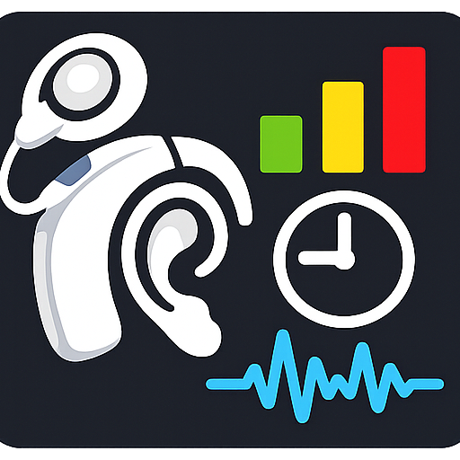

# CI Sound Balancing Tool

A browser-based tool that helps users of cochlear implants measure their perceived loudness and pitch, simulate fittings before going to the audiologist, and print out the requested changes for an appointment.

The tool runs online in your browser: **[CI Sound Balancing Tool](https://www.ci-sound-balancing.org/)**

Supported manufacturers: MED-EL, Cochlear, Advanced Bionics.

## User manual

- 🇩🇪 [Deutsche Anleitung](README_de.md)
- 🇬🇧 [English manual](README_en.md)
- 🇫🇷 [Manuel en français](README_fr.md)
- 🇪🇸 [Manual en español](README_es.md)

## Related links

- Tinnitus toolbox: <https://hearwell.life/>
- Binaural CI alignment: <https://cito.github.io/bicial/>
- Pico ASHA Project: <https://shermp.github.io/Pico-ASHA/>
- ASHA pipewire sink: <https://github.com/thewierdnut/asha_pipewire_sink>

## Speech material and sources

The "Play sentences" feature in the Player tab uses voice recordings
from the following open sources:

- **Thorsten-Voice** — German studio voice by Thorsten Müller,
  training data CC0. <https://www.thorsten-voice.de>
- **Mozilla Common Voice 17.0** — multilingual crowd-sourced speech
  datasets (CC0-1.0). Retrieved through the unofficial Hugging Face
  mirror `fsicoli/common_voice_17_0`.
  <https://commonvoice.mozilla.org>

Selected audio snippets are included in this repository.

## Contact

Feedback is appreciated. Please use [github issues](https://github.com/mviereck/ci-sound-balancing/issues) to contact me. Feel free to ask anything.
