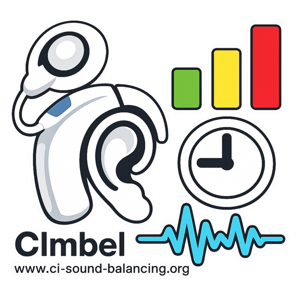

# CImbel - CI Sound Balancing Tool

Dieses Tool dient Trägern von Cochlea Implantaten zur Messung ihrer wahrgenommenen Lautstärken und Tonhöhen. 
- Auf Basis der Meßergebnisse können Audiodateien mit simulierter Anpassung abgespielt werden. 
- Sobald das für Sie gut klingt, können Sie für Ihren Audiologen eine Übersicht gewünschter Änderungen ausdrucken.

Sie finden das Tool hier, es läuft online im Browser: [CI Sound Balancing Tool](https://mviereck.github.io/ci-sound-balancing/)

Sie können das Tool auch offline nutzen. [Download als ZIP Datei](https://github.com/mviereck/ci-sound-balancing/archive/refs/heads/main.zip). Nach dem Entpacken öffnet sich das Tool nach Doppelklick auf *index.html* im Browser.

Das Tool unterstützt Geräte aller drei großen Hersteller: MED-EL, Cochlear und Advanced Bionics.

## Hintergrund

Ziel ist es, daß alle Elektroden sich gleich laut anhören ("loudness balancing"), sowie daß die Tonhöhen links und rechts als gleich hoch bzw. tief empfunden werden.

Dieser Ausgleich von Elektrodenlautstärke (je CI) und Tonhöhen (links/rechts) ist die Basis für angenehmes und möglichst natürliches Hören.

Audiologen haben gewöhnlich nicht genug Zeit, um diese Messungen in der gebotenen Gründlichkeit durchzuführen. Da hilft dieses Tool: Sie können die Messungen allein zu Hause durchführen, ohne jeden Zeitdruck.

Auf Basis dieser selbst ermittelten Meßdaten kann im integrierten Audioplayer eine simulierte Anpassung abgespielt werden. So können Sie vorab einschätzen, was für Sie am Besten klingt.

Zusätzlich zum reinen Ausgleich von Lautstärke und Tonhöhe können Sie halbautomatische Anpassungen zur Verbesserung von Sprachverständnis machen, oder z.B. Bässe oder Höhen betonen. Sie können die Wirkung Ihrer Anpassungen live hören, wenn Sie gleichzeitig Musik oder ein Hörbuch im Audioplayer laufen lassen.

Wenn Sie schließlich eine Anpassung gefunden haben, die Ihnen gut erscheint, können Sie die dafür nötigen Änderungen ausdrucken lassen und Ihrem Audiologen geben.

## Einschränkung

Das Tool arbeitet ausschließlich mit akustischen Signalen. Akustische Signale können auch benachbarte Elektroden mit aktivieren. Das macht die Messung ein Stück weit ungenau. Ideal wäre eine direkte Stimulation der einzelnen Elektroden, aber diese Möglichkeit bleibt dem Audiologen vorbehalten.

## Wichtige Empfehlung: Testprogramm ohne Filter

Damit Sie die Lautstärke der einzelnen Elektroden möglichst unverfälscht beurteilen können, sollten alle automatischen Klangverarbeitungs-Filter im CI-Prozessor deaktiviert sein. Bitten Sie Ihren Audiologen, Ihnen dafür ein zusätzliches Testprogramm einzurichten.

Folgenden Satz können Sie dazu nutzen (Begriffe gelten für MED-EL/MAESTRO; bei Cochlear und Advanced Bionics gibt es entsprechende Filter unter anderen Namen, der Audiologe weiß, was gemeint ist):
  
>„Bitte legen Sie mir auf einer freien Programm-Position eine Test-MAP an, in der alle ASM-Filter deaktiviert sind: 
>
>- Microphone Directionality: Omni
>- Adaptive Intelligence: Off
>- Wind Noise Reduction: Off
>- Ambient Noise Reduction: Off
>- Transient Noise Reduction: Off
>
>Compression Ratio und sonstige Map-Parameter bitte unverändert lassen. Diese MAP brauche ich nur für eine Lautheits-Messung zu Hause."

### Zusätzlich: Daten Ihrer MAP beim Audiologen erfragen

Im Reiter Implantat können Sie zahlreiche technische Werte zu Ihrem CI eintragen. Das Tool funktioniert auch ohne diese Werte; mit ihnen werden die Ergebnisse und Empfehlungen für den Audiologen aber präziser. Sie finden diese Werte nicht selbst, sondern müssen sie beim Audiologen erfragen.

Folgender Satz hilft:

>„Bitte drucken Sie mir einen Fitting-Report (alle Map-Parameter) meiner aktuellen MAP aus. Ich brauche die Werte für eine Lautheits-Messung zu Hause mit dem CI-Sound-Balancing-Tool."

Falls Rückfragen kommen, welche Werte konkret gemeint sind:

>- Implantat-Modell und Audioprozessor-Modell
>- Kodierungsstrategie und Stimulationsrate
>- FAT (Frequency Allocation Table): Mittenfrequenz pro Elektrode in Hz
>- THR (T-Level) pro Elektrode
>- MCL pro Elektrode
>- MED-EL: MCL in qu
>- Cochlear: C-Level in CL
>- Advanced Bionics: M-Level in CU
>- Status jeder Elektrode (aktiv / deaktiviert)
>- MED-EL zusätzlich: MAPLAW c-Wert
>- Cochlear zusätzlich: IIDR (Instantaneous Input Dynamic Range, in dB)
>- Advanced Bionics zusätzlich: IDR (Input Dynamic Range, in dB)

## Vorgehensweise:
### Lautstärke ausgleichen
#### Im Reiter *Implantat*: 
Grundsätzliche technische Angaben zu Ihrem CI.

- Wählen Sie oben die Seite *LINKS/RECHTS* aus, auf der Sie das CI tragen.
- Tragen Sie mindestens Ihren CI Hersteller ein, sofern bekannt, auch Modell usw.
- Markieren Sie deaktivierte Elektroden unter *AKTIV* als *DEAKTIVIERT* (Häkchen entfernen).
- Testen Sie den Ton für jede Elektrode. Auffällige Elektroden, z. B. mit starkem Rauschen, in *STATUS* markieren.
- Idealerweise tragen Sie alle weiteren Ihnen bekannten Angaben und Werte ein, sofern bekannt. Sie können die Werte bei Ihrem Audiologen erfragen. Sie können das Tool aber auch ohne diese Werte nutzen.
- Machen Sie alle Angaben auch für das andere Ohr. Auch *normalhörend* oder *schwerhörig* oder *taub* gegebenenfalls eintragen, wenn sie dort kein CI tragen.

#### Im Reiter *Messungen* -> *Elektrodenlautstärke*
Vergleich der Lautstärken der Elektroden.
- Für die Seite(n) mit CI machen Sie zunächst nur die Messung *Elektrodenlautstärke*.
- In dieser Messung werden alle Elektroden paarweise miteinander verglichen, und Sie justieren die Lautstärke, bis sich beide Elektroden gleich laut anhören.
- Nutzen Sie möglichst Bluetooth zum Streamen.
- Stellen Sie die Lautstärke ihres Computers (oder Smartphones) auf gefühlt 3/4 ein, nicht leise, aber auch noch nicht unangenehm laut.
- Steuerung der Tests:
  - Justieren Sie mit den *Pfeiltasten* die Lautstärke.
  - Mit der *Leertaste* Ton erneut abspielen.
  - Sobald die Töne gleich laut sind, mit *Enter* bestätigen.
  - Optional: Anderen Ton zum Testen auswählen.
    - Anmerkung: Es stehen einige Töne zur Auswahl. 
      - Sinus ist Standard, Komplex ist auch sehr gut. 
      - Schmalbandrauschen kann zu erstaunlich großen Abweichungen in der Messung führen.
        Diesen Ton erst einmal nur experimentell nutzen, oder als ganz eigene Testreihe unabhängig von einer Sinustonmessung.
- Empfohlenes Vorgehen: 
  - Erst Testverfahren *Vollständig*.
  - Dann Testverfahren *Konvergenz*, gerne mehrfach.
  - Unter dem Slider wird eine Marke mit errechnetem Schätzwert und Ungenauigkeitbereich angezeigt. Darauf kann man sich nicht verlassen, es kann aber einen Anhaltspunkt bieten.
- Jeder Test kann jederzeit unterbrochen und später an gleicher Stelle weitergeführt werden.
- Jeder Test kann beliebig oft wiederholt werden, um die Ergebnisse zu verfeinern.
- Die Messungen *Stereo-Balance* und *Frequenzabgleich* zunächst auslassen.
 
#### Im Reiter *Meßergebnisse* -> *Elektrodenlautstärke*
Anzeige der errechneten Anpassung gemäß Ihrer Messungen.

- Im Subreiter *Elektrodenlautstärke* sehen Sie die empfohlenen Veränderungen pro Elektrode dargestellt in einer Grafik.
- Die Farben der Balken pro Elektrode deuten an, wie sicher das Meßergebnis zu beurteilen ist:
  - *rot*: Ergebnis unsicher, große Abweichungen in den Messungen
  - *gelb*: Ergebnis brauchbar, gut, ok
  - *grün*: Sehr gutes Ergebnis, zuverlässig
- Der Wert *Residuum* zeigt die Verläßlichkeit der Messung als mathematischen Wert. Ein *Residuum* <1 ist sehr gut und wird *grün* angezeigt. Das heißt, die Abweichung der Messungen liegt bei unter 1 Dezibel.
 
#### Im Reiter *Player*
Spielen Sie eine Audiodatei ab, um die Auswirkung Ihrer Messungen zu simulieren. 
- Der eingebaute Equalizer verändert den Ton annähernd so, wie er sich anhören würde, wenn der Audiologe Ihr CI gemäß Ihren Messungen neu einstellt.
- Mit dem Ausgleich der Elektrodenlautstärke Ihres CI haben Sie eine wertvolle Grundlage geschaffen. Damit sollte sich bereits vieles klarer anhören als vorher.
- Schalten Sie den Button *Messungen* mehrfach an und wieder aus, um den Unterschied zu hören.

#### Im Reiter *Kurven*

Im Reiter *Kurven* können Sie die Lautstärke aller Elektroden gemeinsam einer Kurve folgend verändern. Dafür stehen verschiedene Kurvenberechnungen zur Verfügung.

Empfehlungen:
- Lassen Sie eine Audiodatei im *Player* laufen. Nehmen Sie ein Hörbuch.
- Aktivieren Sie *Sprache*. Ändern Sie die Einstellung mit den *Pfeiltasten hoch/runter* und hören Sie live, wie sich die Veränderung auf Ihr Sprachverstehen auswirkt.
- Deaktivieren Sie *Sprache* und aktivieren Sie *Sinus*. Lassen Sie Musik im *Player* laufen. Verändern Sie mit den *Pfeiltasten hoch/runter* den Wert und hören Sie live, wie sich Höhen und Bässe verändern.
- Deaktivieren Sie *Sinus* und probieren Sie auch andere Kurven aus.
- Finden Sie eine Kurve oder eine Kombination von Kurven, die Ihnen zusagt.
- Gehen Sie in den Reiter *Player*, spielen Sie etwas ab, und schalten Sie den Button *Kurven* mehrfach an und wieder aus, um den Unterschied zu hören.

#### Im Reiter *Laden/Speichern*
- Sichern Sie Ihre Meßdaten und Ihre Einstellungen.

## Für Ihren Audiologen
Ausdrucke für Ihren Audiologen mit den gewünschten Änderungen.

- Stellen Sie im *Player* alles so ein, wie Sie hören möchten.
  - Beachten Sie dabei auch die Einstellung *LINKS/RECHTS* sowie die Checkbox *Beide Seiten*.
- Gehen Sie in den Reiter *Laden/Speichern* und klicken Sie auf *Drucken*.
- Stellen Sie den Player so ein, daß nur Lautstärkenausgleich (Button *Gemessen*) erfolgt. Die Buttons *Kurven* und *Schieber* deaktivieren. Drucken Sie auch das aus als Einstellungswunsch für Ihr zukünftiges Testprogramm.
- Nehmen Sie die Ausdrucke mit zu Ihrem nächsten Audiologentermin.

### Empfehlung für neue Programmbelegung
- Behalten Sie unverändert das Programm, das Sie bisher gut gewohnt sind und im Alltag benutzen.
- Belegen Sie einen Programmplatz als Testprogramm mit exakt gleich lauten Elektroden ohne Filter. Das wird Ihre Basis für zukünftige Messungen und Experimente.
  - Dieses Testprogramm könnte auch ein Lieblingsprogramm für Musik oder Naturgeräusche für Sie werden.
- Belegen Sie ein oder zwei Programmplätze mit Wunscheinstellungen, die Sie mit Hilfe des Tools ermittelt haben.

### Einschränkung
Wenn Sie im Tool die *MCL* Werte der Elektroden eingetragen haben, errechnet das Tool neben der Differenz in Dezibel (dB) außerdem eine Differenz in der Einheit des Audiologenprogrammes. Dies wird mit ausgedruckt. Diese errechneten Werte sind noch nicht auf Verläßlichkeit geprüft. Hinzu kommt, daß das Ohr als Organ etwas anders auf die Einstellungen reagiern könnte, als eine Berechnung vorhersagen kann.

## Weitere Messungen

### Reiter *Messungen* -> *Stereo-Balance*
Lautstärkenvergleich links und rechts. 
- Vor dieser Messung sollte die Messung *Elektrodenlautstärke* bereits durchgeführt worden sein.
- Aus der Messung wird ein Mittelwert berechnet, der als Empfehlung für Lautstärkenanhebung  oder -absenkung für eine Seite empfohlen wird.
- Der Ausgleich kann im Player per Button aktiviert werden.

### Reiter *Messungen* -> *Latenz*
Zeitversatz zwischen links und rechts messen.
- Bei unterschiedlicher Versorgung links und rechts können die Töne zeitversetzt eintreffen.
- Mit diesem Test können Sie diese Latenz messen. Je nach Gerät kann eine Korrektur vom Audiologen oder Akustiker vorgenommen werden.
- Wenn die Lautsärke links und rechts sehr gut ausgeglichen ist, können Sie als Anhaltspunkt auch darauf achten, "wo" Sie den Ton hören. Eher links, rechts, oder mittig im Kopf.
- Ein Ausgleich kann im Player aktiviert werden.

Dieses Meßverfahren ist noch etwas rudimentär und soll in zukünftigen Versionen verfeinert werden.
 
### Reiter *Messungen* -> *Frequenzabgleich*
Messung von Tonhöhenunterschieden links und rechts.
- Es ist vorteilhaft, vor dieser Messung *Elektrodenlautstärke* und *Stereo-Balance* bereits durchgeführt zu haben. 

Das Vorgehen ist in 2 Tests aufgeteilt. Der erste Test mit Slider dient nur dazu, gute Startwerte für den zeitintensiven zweiten test zu bekommen.
#### Test 1: Vor-Schätzung (Slider)
- Pro Elektrode wird der gleiche Ton links und rechts abgespielt. Korrigieren Sie mit dem Slider / mit den Pfeiltasten, bis sich die Töne links und rechts gleich hoch bzw. tief anhören.
#### Test 2: Adaptiv
- Es werden Tonfolgen abgespielt, und Sie geben für jede Tonfolge an, ob der zweite Ton höher oder tiefer als der erste war.
- Sie kommen irgendwann an einen Punkt, wo Sie das kaum oder nicht mehr unterscheiden können. Antworten Sie dann intuitiv, auch wenn der Verstand keinen Unterschied mehr erkennt.
#### Player
- Im *Player* kann unter *Experimentell* eine Simulation veränderter Tonhöhen abgespielt werden, die Qualität der Simulation ist aber noch bescheiden. Es kann aber eine Idee davon geben, wie die Veränderung wirken könnte.
#### Hinweis zu Hörgeräten:
- Wenn Sie auf dem anderen Ohr natürlich hören, aber schwerhörig sind, kann es helfen, sich das Hörgerät für den Test so einstellen zu lassen, daß es keine Frequenzverschiebung vornimmt, sondern nur die Lautstärke verbessert.
- Wenn Sie auf dem anderen Ohr ein Hörgerät tragen, daß Frequenzverschiebung macht, etwa hohe Töne als tiefere Töne wiederzugeben, ist es für den Test nicht geeignet. Sie würden mit den verschobenen Frequenzen testen.

### Reiter *Schieber*
Erlaubt manuelle Lautstärkeänderung einzelner Elektroden.
- Diese Funktion werden Sie in der Regel nicht benötigen. Sie gibt Ihnen Freiheit für Experimente.
- Es gibt einen *relativ* und einen *absolut* Modus. Der *absolut* Modus ist nur verwendbar, wenn im Reiter *Implantat* die MCL Werte eingegeben wurden.
- Sie können die Veränderung durch *Elektrodenlautstärke* und *Kurven* mit einblenden lassen.
- Sie können die Veränderungen live im Player hören.

